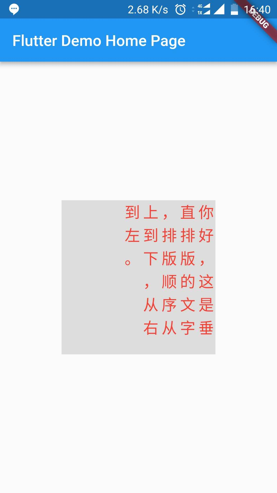

# flutter_app

A new Flutter application.

Aligns Text Vertical from right-top to left bottom.support emoji.
排版文字从右往左。支持emoji。

Screenshot

 

how to use: see main.dart

    CustomPaint(
      painter: VerticalText(
        text: "你好，这是垂直排版的文字，排版顺序从上到下，从右到左。",
        textStyle: TextStyle(
          color: Colors.red,
          fontSize: 20,
          letterSpacing: 4,
          wordSpacing: 4),
        width: 200,
        height: 200,
        ),
    )

    
 ---------------------------------------------------------

## Getting Started

This project is a starting point for a Flutter application.

A few resources to get you started if this is your first Flutter project:

- [Lab: Write your first Flutter app](https://flutter.io/docs/get-started/codelab)
- [Cookbook: Useful Flutter samples](https://flutter.io/docs/cookbook)

For help getting started with Flutter, view our 
[online documentation](https://flutter.io/docs), which offers tutorials, 
samples, guidance on mobile development, and a full API reference.
